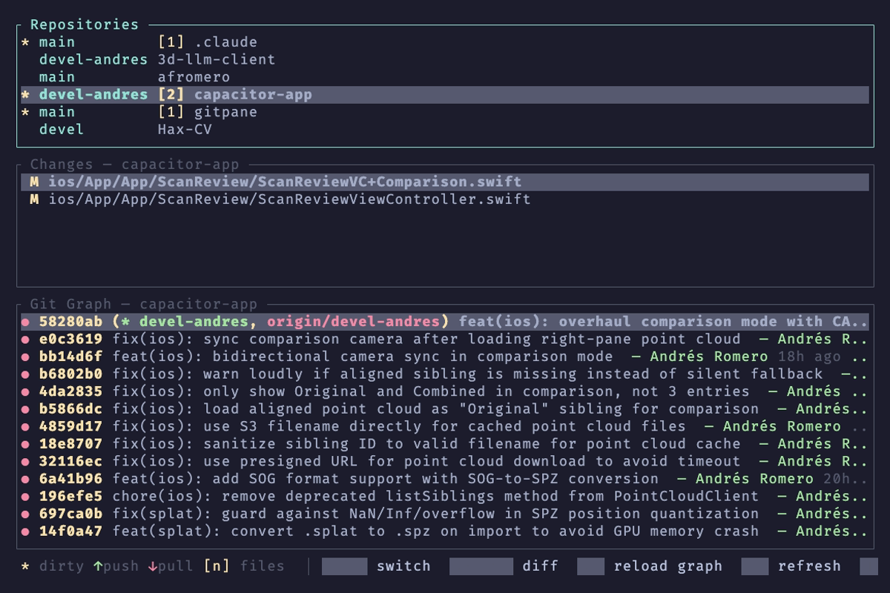
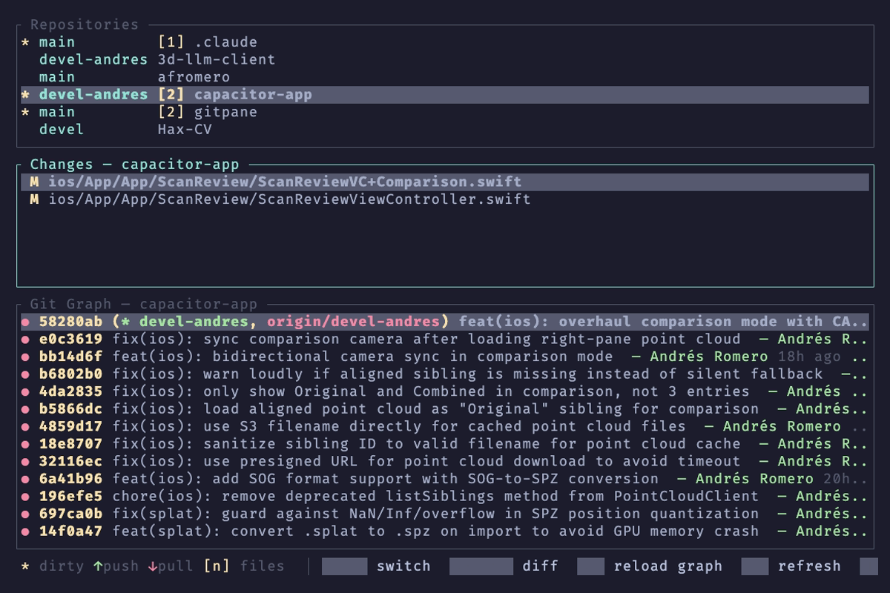
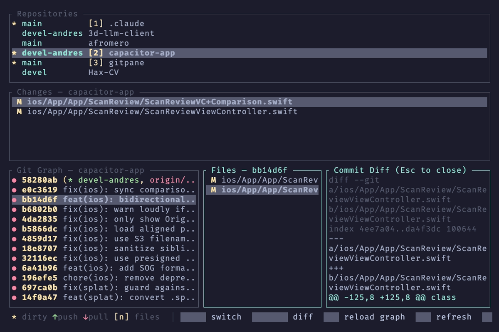

<p align="center">
  <h1 align="center">gitpane</h1>
  <p align="center">
    <strong>Multi-repo Git workspace dashboard for the terminal</strong>
  </p>
  <p align="center">
    <a href="https://github.com/affromero/gitpane/actions/workflows/ci.yml"></a>
    <a href="https://crates.io/crates/gitpane"></a>
    <a href="https://github.com/affromero/gitpane/releases/latest"></a>
    <a href="https://github.com/affromero/gitpane/blob/main/LICENSE"></a>
    
    
  </p>
</p>

---

Monitor **all your repos at a glance** — branch, dirty state, ahead/behind, changed files, and commit history — without leaving the terminal.

<p align="center">
  
</p>

## Install

```bash
cargo install gitpane
```

That's it. No cloning, no building from source. Runs on **Linux, macOS, and Windows**.

> **Don't have Rust?** Download a pre-built binary from [GitHub Releases](https://github.com/affromero/gitpane/releases/latest) — single static binary, zero dependencies.
>
> ```bash
> # macOS (Apple Silicon)
> curl -LO https://github.com/affromero/gitpane/releases/latest/download/gitpane-aarch64-apple-darwin.tar.gz
> tar xzf gitpane-aarch64-apple-darwin.tar.gz && sudo mv gitpane /usr/local/bin/
>
> # macOS (Intel)
> curl -LO https://github.com/affromero/gitpane/releases/latest/download/gitpane-x86_64-apple-darwin.tar.gz
> tar xzf gitpane-x86_64-apple-darwin.tar.gz && sudo mv gitpane /usr/local/bin/
>
> # Linux (x86_64, statically linked)
> curl -LO https://github.com/affromero/gitpane/releases/latest/download/gitpane-x86_64-unknown-linux-musl.tar.gz
> tar xzf gitpane-x86_64-unknown-linux-musl.tar.gz && sudo mv gitpane /usr/local/bin/
>
> # Linux (ARM64)
> curl -LO https://github.com/affromero/gitpane/releases/latest/download/gitpane-aarch64-unknown-linux-gnu.tar.gz
> tar xzf gitpane-aarch64-unknown-linux-gnu.tar.gz && sudo mv gitpane /usr/local/bin/
> ```

Then run:

```bash
gitpane                     # Scans ~/Code by default
gitpane --root ~/projects   # Scan a specific directory
```

## Why gitpane?

If you work across multiple repositories — microservices, monorepos with submodules, a mix of projects — you know the pain of `cd`-ing into each one to check status. Existing TUI tools focus on **one repo at a time**:

| Tool | Multi-repo | Real-time watch | Mouse | Commit graph | Split diffs | Push/Pull |
|------|:---:|:---:|:---:|:---:|:---:|:---:|
| **gitpane** | **Yes** | **Yes** | **Yes** | **Yes** | **Yes** | **Yes** |
| [lazygit](https://github.com/jesseduffield/lazygit) | No | No | Yes | Yes | Yes | Yes |
| [gitui](https://github.com/extrawurst/gitui) | No | No | Yes | Yes | Yes | Yes |
| [tig](https://github.com/jonas/tig) | No | No | No | Yes | No | No |
| [git-delta](https://github.com/dandavison/delta) | No | No | No | No | Yes (pager) | No |
| [grv](https://github.com/rgburke/grv) | No | No | Yes | Yes | No | No |
| [git-summary](https://github.com/MircoT/git-summary) | Yes (list only) | No | No | No | No | No |
| [mgitstatus](https://github.com/fboender/multi-git-status) | Yes (list only) | No | No | No | No | No |
| [gita](https://github.com/nosarthur/gita) | Yes (CLI only) | No | No | No | No | Yes |

**lazygit** and **gitui** are excellent for deep single-repo work — staging hunks, interactive rebase, conflict resolution. gitpane is the **workspace-level dashboard** — see everything across all repos, drill into anything, never leave the terminal. They complement each other.

## Screenshots

### Three-panel overview
Repos on the left show branch, dirty state (`*`), ahead/behind arrows (`↑↓`), and file count. Changes in the middle. Commit graph on the right.



### Split diff view
Click a changed file (or press Enter) to see its diff side-by-side. File list stays navigable on the left.



### Commit detail drill-down
Click a commit in the graph to see its files. Click a file to see the commit diff. Layered Esc dismissal: diff → files → graph.



## Features

- **Multi-repo overview** — Scans `~/Code` (configurable) for git repos; shows branch, dirty indicator (`*`), ahead/behind arrows (`↑↓`), and change count
- **Real-time filesystem watching** — Status updates within ~500ms of any file change via `notify`
- **Commit graph** — Lane-based graph with colored box-drawing characters, up to 200 commits
- **Split diff views** — Click a file to see its diff side-by-side; click a commit to see its files and per-file diffs
- **Full mouse support** — Click to select, right-click for context menu, scroll wheel everywhere
- **Push / Pull / Rebase** — Right-click context menu with ahead/behind-aware git operations (explicit `origin <branch>` for reliability)
- **Add & remove repos** — Press `a` to add any repo with tab-completing path input; `d` to remove; `R` to rescan
- **Sort repos** — Cycle between alphabetical and dirty-first with `s`
- **Copy to clipboard** — Press `y` to copy selected item from any panel (OSC 52)
- **Configurable** — TOML config for root dirs, scan depth, pinned repos, exclusions, frame rate
- **Responsive layout** — Three horizontal panels on wide terminals, vertical stack on narrow ones
- **Cross-platform** — Linux, macOS, Windows

## Keybindings

### Global

| Key | Action |
|-----|--------|
| `Tab` / `Shift+Tab` | Cycle focus between panels |
| `r` | Refresh all repo statuses |
| `R` | Rescan directories for repos (clears exclusions) |
| `g` | Reload git graph for selected repo |
| `a` | Add a repo (opens path input with tab completion) |
| `d` | Remove selected repo from the list |
| `s` | Cycle sort order (Alphabetical / Dirty-first) |
| `y` | Copy selected item to clipboard |
| `q` | Quit (or close diff if one is open) |
| `Esc` | Navigate back through panels, then quit |

### Panel navigation

| Key | Repos | Changes | Graph |
|-----|-------|---------|-------|
| `j` / `↓` | Next repo | Next file | Next commit / file |
| `k` / `↑` | Prev repo | Prev file | Prev commit / file |
| `Enter` | — | Open diff | Open commit files / file diff |
| `Esc` / `h` / `←` | — | Close diff | Close diff → close files → back |

### Mouse

| Action | Effect |
|--------|--------|
| Left click | Select item, switch panel focus |
| Click selected row | Open diff / commit detail |
| Right click (repo list) | Context menu (push, pull, copy path) |
| Scroll wheel | Navigate lists or scroll diffs |

### Path input (`a`)

| Key | Action |
|-----|--------|
| `Tab` | Autocomplete directory path (cycles matches) |
| `Enter` | Add the repo |
| `Esc` | Cancel |
| `Ctrl+A` / `Home` | Cursor to start |
| `Ctrl+E` / `End` | Cursor to end |
| `Ctrl+U` | Clear line before cursor |

## Configuration

Config file location: `~/.config/gitpane/config.toml`

```toml
# Directories to scan for git repositories
root_dirs = ["~/Code", "~/work"]

# Maximum directory depth for repo discovery
scan_depth = 2

# Always show these repos at the top
pinned_repos = ["~/Code/important-project"]

# Skip repos matching these directory names
excluded_repos = ["node_modules", ".cargo", "target"]

[watch]
debounce_ms = 500    # Filesystem change debounce (ms)

[ui]
frame_rate = 30      # Terminal refresh rate (fps)
```

See [`examples/config.toml`](examples/config.toml) for a fully annotated example.

## Architecture

```
┌──────────────────────────────────────────────────────────┐
│                     tokio runtime                        │
│  ┌──────────┐  ┌──────────┐  ┌──────────────────────┐   │
│  │ Event    │→ │ Action   │→ │ Components            │   │
│  │ Loop     │  │ Dispatch │  │  RepoList             │   │
│  │ (tui.rs) │  │ (app.rs) │  │  FileList (split diff)│   │
│  └──────────┘  └──────────┘  │  GitGraph (drill-down)│   │
│       ↑                      │  ContextMenu          │   │
│  ┌──────────┐                │  PathInput             │   │
│  │ notify   │                │  StatusBar             │   │
│  │ watcher  │                └──────────────────────┘   │
│  └──────────┘                                           │
│       ↑              ┌───────────────────────┐           │
│  filesystem          │ git2 (spawn_blocking) │           │
│  changes             │  status · graph       │           │
│                      │  commit_files · fetch │           │
│                      └───────────────────────┘           │
└──────────────────────────────────────────────────────────┘
```

- **[ratatui](https://github.com/ratatui/ratatui)** + **[crossterm](https://github.com/crossterm-rs/crossterm)** — TUI rendering with full mouse support
- **[git2](https://github.com/rust-lang/git2-rs)** (libgit2) — Branch, status, ahead/behind, graph, commit diffs
- **[notify](https://github.com/notify-rs/notify)** — Filesystem watching with configurable debounce
- **[tokio](https://github.com/tokio-rs/tokio)** — Async runtime; git queries run in `spawn_blocking` to keep the UI responsive

Message-passing architecture: terminal events → actions → component updates → render. Each component implements a `Component` trait with `draw`, `handle_key_event`, `handle_mouse_event`, and `update`.

## Development

```bash
just run           # Build and run
just test          # Run test suite (17 tests)
just fmt           # Format code
just lint          # Run clippy
just ci            # fmt + lint + test (mirrors CI pipeline)
```

### Project structure

```
src/
├── main.rs              # Entry point, CLI parsing
├── app.rs               # Main loop, action dispatch, layout
├── action.rs            # Action enum (message passing)
├── event.rs             # Terminal event types
├── tui.rs               # Terminal setup, event loop
├── config.rs            # TOML config load/save
├── watcher.rs           # Filesystem watcher → repo index mapping
├── components/
│   ├── mod.rs           # Component trait
│   ├── repo_list.rs     # Left panel: repo list with status
│   ├── file_list.rs     # Middle panel: changed files + split diff
│   ├── git_graph.rs     # Right panel: commit graph + drill-down
│   ├── context_menu.rs  # Right-click overlay
│   ├── path_input.rs    # Add-repo input overlay
│   └── status_bar.rs    # Bottom bar with keybinding hints
└── git/
    ├── mod.rs
    ├── scanner.rs       # Repo discovery via walkdir
    ├── status.rs        # Branch, files, ahead/behind, fetch
    ├── graph.rs         # Lane-based commit graph builder
    ├── graph_render.rs  # Box-drawing character rendering
    └── commit_files.rs  # Commit file list and per-file diffs
```

## License

[MIT](LICENSE)
