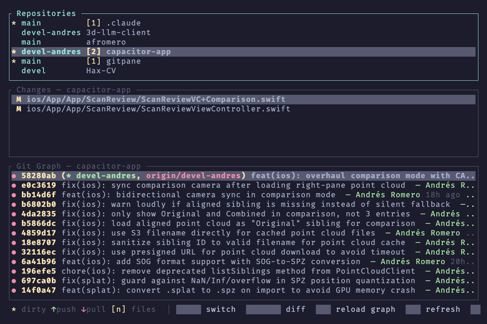
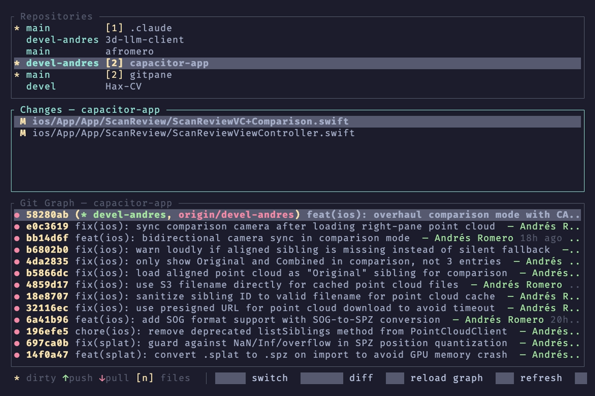
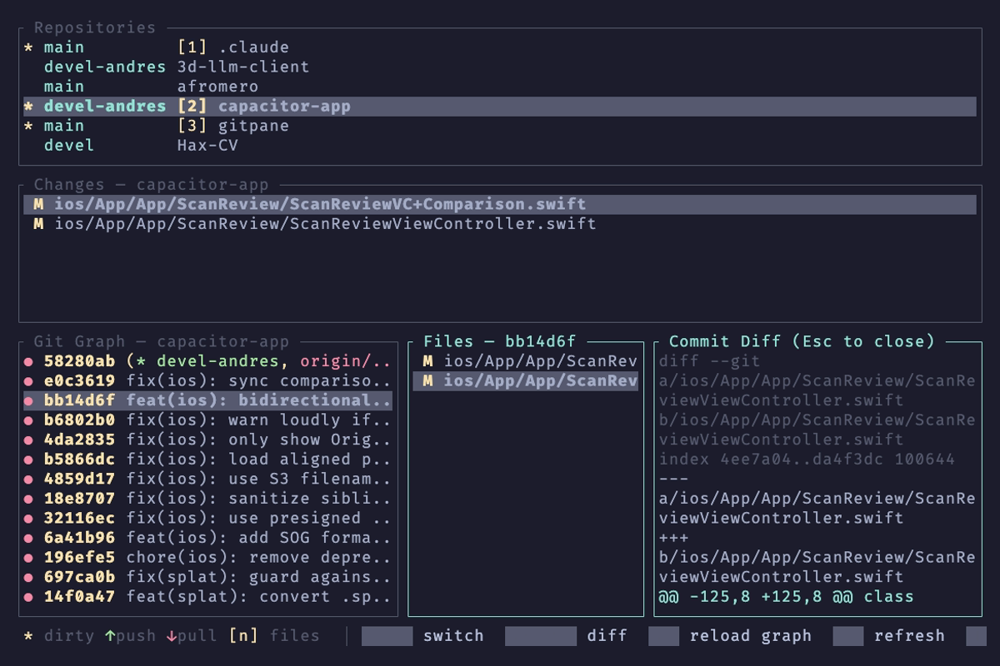
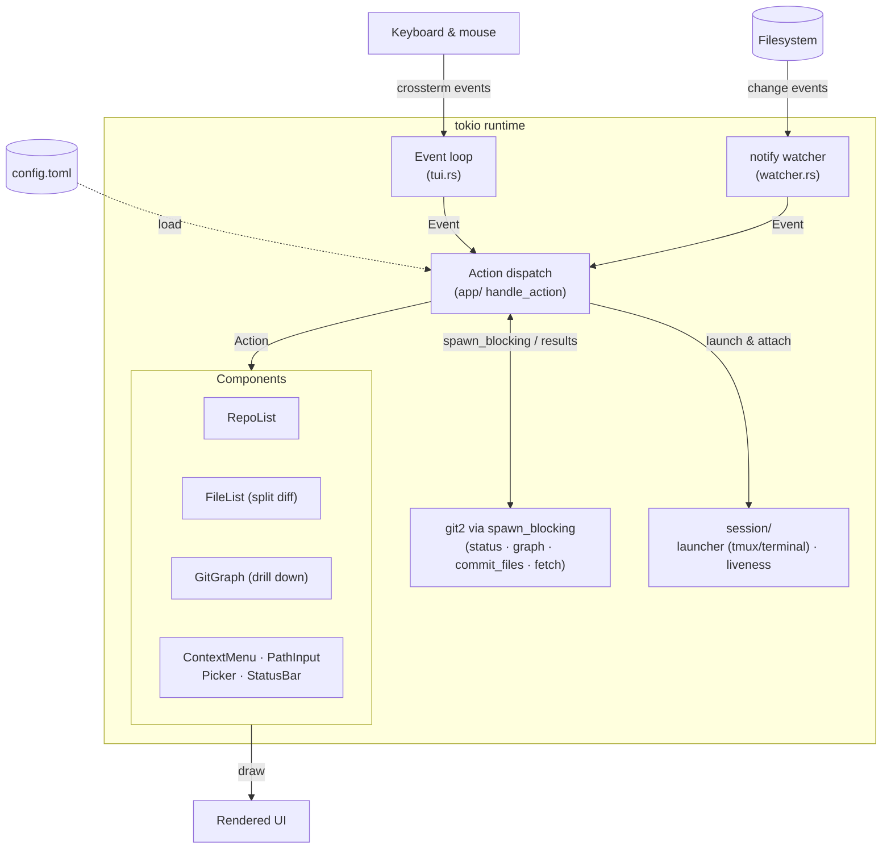

<div align="center">
  <h1>gitpane</h1>
  <p align="center">
    <strong>Multi repo Git workspace dashboard for the terminal</strong>
  </p>
  <p align="center">
    <a href="https://github.com/affromero/gitpane/actions/workflows/ci.yml"></a>
    <a href="https://github.com/affromero/gitpane/actions/workflows/security.yml"></a>
    <a href="https://github.com/affromero/gitpane/actions/workflows/coverage.yml"></a>
    <a href="https://github.com/affromero/gitpane/actions/workflows/docs.yml"></a>
    <a href="https://github.com/affromero/gitpane/actions/workflows/gitleaks.yml"></a>
    <br>
    <a href="https://crates.io/crates/gitpane"></a>
    <a href="https://docs.rs/gitpane"></a>
    <a href="https://deps.rs/repo/github/affromero/gitpane"></a>
    <a href="https://github.com/affromero/gitpane/blob/main/Cargo.toml"></a>
    <a href="https://crates.io/crates/gitpane"></a>
    <br>
    <a href="https://github.com/affromero/gitpane/releases/latest"></a>
    <a href="https://github.com/affromero/gitpane/releases"></a>
    <a href="https://github.com/affromero/gitpane/blob/main/LICENSE"></a>
    
    
    <a href="https://github.com/affromero/gitpane/blob/main/AGENTS.md"></a>
  </p>
</div>

Monitor **all your repos at a glance**. See branch, dirty state, ahead/behind, active worktrees, changed files, and commit history without leaving the terminal.

<p align="center">
  
</p>

## Install

```bash
cargo install gitpane
```

That's it. No cloning, no building from source. Runs on **Linux, macOS, and Windows**.

> **Don't have Rust?** Download a prebuilt binary from [GitHub Releases](https://github.com/affromero/gitpane/releases/latest). It is a single static binary with zero dependencies.
>
> ```bash
> # macOS (Apple Silicon)
> curl -LO https://github.com/affromero/gitpane/releases/latest/download/gitpane-aarch64-apple-darwin.tar.gz
> tar xzf gitpane-aarch64-apple-darwin.tar.gz && sudo mv gitpane /usr/local/bin/
>
> # macOS (Intel)
> curl -LO https://github.com/affromero/gitpane/releases/latest/download/gitpane-x86_64-apple-darwin.tar.gz
> tar xzf gitpane-x86_64-apple-darwin.tar.gz && sudo mv gitpane /usr/local/bin/
>
> # Linux (x86_64, statically linked)
> curl -LO https://github.com/affromero/gitpane/releases/latest/download/gitpane-x86_64-unknown-linux-musl.tar.gz
> tar xzf gitpane-x86_64-unknown-linux-musl.tar.gz && sudo mv gitpane /usr/local/bin/
>
> # Linux (ARM64)
> curl -LO https://github.com/affromero/gitpane/releases/latest/download/gitpane-aarch64-unknown-linux-gnu.tar.gz
> tar xzf gitpane-aarch64-unknown-linux-gnu.tar.gz && sudo mv gitpane /usr/local/bin/
> ```

> **On NetBSD?** gitpane is available as a community-maintained [pkgsrc](https://www.pkgsrc.org/) package in [`devel/gitpane`](https://pkgsrc.se/devel/gitpane), thanks to [@0323pin](https://github.com/0323pin):
>
> ```sh
> pkgin install gitpane                            # prebuilt binary package
> cd /usr/pkgsrc/devel/gitpane && make install     # build from pkgsrc source
> ```

Then run:

```bash
gitpane                     # Scans ~/Code by default
gitpane --root ~/projects   # Scan a specific directory
gitpane diagnostic          # Print config, watcher, and workspace diagnostics
```

## Update

If you installed with cargo, gitpane can update itself:

```bash
gitpane update              # checks for a newer release, then runs cargo install
cargo install gitpane       # the equivalent manual command, overwrites the old binary
```

If you installed from a [GitHub Release](https://github.com/affromero/gitpane/releases/latest), download the latest binary for your platform using the same commands from the install section above.

On NetBSD, update through pkgsrc instead of `gitpane update`, which shells out to `cargo install` and would replace the package-managed binary with a cargo-built one.

## Why gitpane?

If you work across multiple repositories, such as microservices, monorepos with submodules, or a mix of projects, you know the pain of checking status one directory at a time. Existing TUI tools focus on **one repo at a time**:

| Tool | Multi repo | Auto refresh | Worktrees | Mouse | Commit graph | Split diffs | Push/Pull | Issues/PRs |
|------|:---:|:---:|:---:|:---:|:---:|:---:|:---:|:---:|
| **gitpane** | **Yes** | **Yes** | **Yes** | **Yes** | **Yes** | **Yes** | **Yes** | **Yes** |
| [lazygit](https://github.com/jesseduffield/lazygit) | No | No | No | Yes | Yes | Yes | Yes | No |
| [gitui](https://github.com/extrawurst/gitui) | No | No | No | Yes | Yes | Yes | Yes | No |
| [tig](https://github.com/jonas/tig) | No | No | No | No | Yes | No | No | No |
| [git-delta](https://github.com/dandavison/delta) | No | No | No | No | No | Yes (pager) | No | No |
| [grv](https://github.com/rgburke/grv) | No | No | No | Yes | Yes | No | No | No |
| [git-summary](https://github.com/MircoT/git-summary) | Yes (list only) | No | No | No | No | No | No | No |
| [mgitstatus](https://github.com/fboender/multi-git-status) | Yes (list only) | No | No | No | No | No | No | No |
| [gita](https://github.com/nosarthur/gita) | Yes (CLI only) | No | No | No | No | No | Yes | No |
| [gitbatch](https://github.com/isacikgoz/gitbatch) | Yes (TUI) | No | No | No | No | No | Yes (batch) | No |
| [gwq](https://github.com/d-kuro/gwq) | Yes (CLI) | No | Yes | No | No | No | No | No |
| [Canopy](https://github.com/ashmitb95/canopy) | Yes (CLI) | No | Yes | No | No | No | No | No |
| [ghpeek](https://github.com/kimusan/ghpeek) | GitHub only | No | No | Yes | No | No | No | Yes |
| [gh-dash](https://github.com/dlvhdr/gh-dash) | GitHub only | Yes | No | No | No | No | Partial | Yes |

**lazygit** and **gitui** are excellent for deep single repo work like staging hunks, interactive rebase, and conflict resolution. gitpane is the **workspace level dashboard**. It shows every repo at once, lets you drill into anything, and keeps you in the terminal. They complement each other.

**ghpeek** and **gh-dash** live on the other side, they are GitHub dashboards for issues and pull requests with no view of your local working copies. gitpane folds a lightweight version of that in: select a repo and, when it has open issues or PRs on its `github.com` remote (`origin` preferred, else any remote pointing at github.com), a fourth panel appears with the list, a preview (body plus comments), and open-in-browser, fetched on demand through the `gh` CLI. It is the only tool here that pairs the local multi-repo workspace with a GitHub peek.

A newer category of **worktree dashboards** has grown up around parallel AI agents, such as [gwq](https://github.com/d-kuro/gwq) (worktree status list with tmux integration), Canopy, and [git-worktree-manager](https://github.com/nanasess/git-worktree-manager). gitpane overlaps here, it expands each repo into its per worktree branch, ahead/behind, dirty, and submodule state, but pairs that with a full commit graph, split diffs, and remote ops the dashboard-only tools lack. With `o` to open any repo or worktree in a new tmux pane (or your editor), it is both the **overview** and the **launchpad**.

## Screenshots

### Three panel overview
Repos on the left show dirty state (`*`), branch (dimmed on `main`/`master` so only deviations carry color), ahead/behind arrows (`↑↓`), worktree count (`⎇`), dirty submodules (`◈`), unpushed submodule pointer (`⇡`), stash count (`$`), and file count. Names and branches align into columns; the rest packs tight per row. Changes in the middle. Commit graph on the right.



### Split diff view
Click a changed file (or press Enter) to see its diff side by side. File list stays navigable on the left.



### Commit detail drill down
Click a commit in the graph to see its files, and the diff follows whichever file is highlighted as you move through the list. Press Enter (or click inside the diff) to focus it for scrolling. Layered Esc dismissal: leave the diff → close files → graph.



## Features

- **Multi repo overview**: Scans `~/Code` (configurable) for git repos. It shows dirty indicator (`*`), branch (dimmed on the default branch), ahead/behind arrows (`↑↓`), worktree count (`⎇`), dirty submodule (`◈`), unpushed submodule pointer (`⇡`), stash count (`$`), and change count.
- **Worktree awareness**: Shows the number of linked git worktrees per repo (`⎇2`). In the agentic AI era, tools like Claude Code create worktrees for parallel development. gitpane lets you see which repos have active parallel work.
- **Open / jump in**: Press `o` (or the `Open` context menu item) to drop into the selected repo or worktree, a new tmux pane at its directory by default, or any `[open]` command you configure (`cursor {path}`, `code {path}`, ...). Turns the overview into a launchpad instead of a dead end.
- **Custom keybindings**: Bind your own keys to shell commands with `[[keybindings]]`, each run against the selected repo/worktree with `{path}` substitution and the same placement options as `[open]`. Extend gitpane with your own verbs without waiting on a feature.
- **Agent liveness**: A `◉` marks any repo or worktree that has a live tmux pane open inside it, so at a glance you can see which parallel agents are actively working where. tmux only; toggle with `[ui] show_liveness`.
- **Filesystem awareness**: Watches repo roots and Git metadata for commits, checkouts, and new repos. Local polling catches nested worktree file changes without overwhelming Linux inotify.
- **Commit graph**: Lane based graph with colored box drawing characters, up to 200 commits.
- **Split diff views**: Click a file to see its diff side by side. Click a commit to see its files, with the diff of the highlighted file alongside them.
- **Full mouse support**: Click to select, right click for context menu, scroll wheel everywhere.
- **Push / Pull / Rebase**: Right click context menu with git operations that account for ahead and behind state, plus `p`/`P` pull/push shortcuts. A branch with a configured upstream is pulled/pushed bare so git's own config (including renamed upstream branches) decides the destination; without one, gitpane resolves the repo's real remote (`origin` when present, else the workspace's own remote, as in Gerrit/mirror setups) and passes `<remote> <branch>` explicitly.
- **Add and remove repos**: Press `a` to add any repo with tab completing path input. Press `d` to remove. Press `R` to rescan.
- **Sort repos**: Cycle between alphabetical and dirty first with `s`.
- **Copy to clipboard**: Press `y` to copy selected item from any panel (OSC 52).
- **Configurable**: TOML config for root dirs, scan depth, pinned repos, exclusions, frame rate.
- **Responsive layout**: Three horizontal panels on wide terminals, vertical stack on narrow ones.
- **Cross platform**: Linux, macOS, Windows.

## Keybindings

### Global

| Key | Action |
|-----|--------|
| `?` | Toggle keybindings help overlay |
| `Tab` / `Shift+Tab` | Cycle focus between panels |
| `r` | Refresh all repo statuses |
| `R` | Rescan directories for repos (clears exclusions) |
| `g` | Reload git graph for selected repo |
| `o` | Open selected repo/worktree (new tmux pane, or `[open]` command) |
| `v` | Review selected repo/worktree's diff vs its base branch (new tmux window) |
| `G` | Attach the live tmux session(s) for the selected repo/worktree |
| `p` | Pull the selected repo/worktree |
| `P` | Push the selected repo/worktree |
| `=` | Toggle the GitHub panel (issues/PRs) for the selected repo |
| `a` | Add a repo (opens path input with tab completion) |
| `d` | Remove selected repo, or worktree if a worktree row is selected (with confirmation) |
| `s` | Cycle sort order (Alphabetical / Dirty first) |
| `w` | Toggle worktree subtree for the selected repo |
| `S` | Toggle stash subtree for the selected repo |
| `t` | Open the theme picker (live preview, Enter to persist) |
| `y` | Copy selected item to clipboard |
| `q` | Quit (closes an open diff first; waits for an in-flight pull/push, press again to force) |
| `Esc` | Navigate back through panels, then quit |

Bind your own keys to shell commands on top of these, see [Custom keybindings](#custom-keybindings).

### Repos panel

| Key | Action |
|-----|--------|
| `j` / `↓` | Next repo |
| `k` / `↑` | Previous repo |

### Changes panel

| Key | Action |
|-----|--------|
| `j` / `↓` | Next file |
| `k` / `↑` | Previous file |
| `Enter` | Open split diff view |
| `Esc` / `h` / `←` | Close diff view |

### Graph panel

| Key | Action |
|-----|--------|
| `j` / `↓` | Next commit / file, or scroll a focused diff down |
| `k` / `↑` | Previous commit / file, or scroll a focused diff up |
| `h` / `l` | Scroll graph left / right |
| `Enter` | Open commit files, then focus the diff to scroll it |
| `Esc` | Leave diff → close files → back |
| `/` | Search commits (message, author, short ID) |
| `n` / `N` | Next / previous search match |
| `f` | Toggle first parent mode |
| `c` | Collapse / expand branch |
| `H` | Expand all collapsed branches |

### GitHub panel

Appears automatically when the selected repo's `github.com` remote has open issues or PRs (opt-out via `[github] enabled`); press `=` to force it open on any repo. Requires the `gh` CLI, whose auth it reuses.

Each pull request row shows its rolled-up CI status: a green `✓` when checks passed, a red `✗` when any failed, a yellow `●` while checks are still running, and nothing when a PR has no checks.

| Key | Action |
|-----|--------|
| `j` / `↓` | Next item / scroll preview |
| `k` / `↑` | Previous item / scroll preview |
| `Enter` | Open preview (body + comments); again opens in browser |
| `Esc` / `q` | Close the preview |
| `c` | Cycle state filter: open → all → closed |
| `p` | Hide the panel |

### Mouse

| Action | Effect |
|--------|--------|
| Left click | Select item, switch panel focus |
| Click selected row | Open diff / commit detail |
| Right click (repo list) | Context menu (push, pull, copy path) |
| Scroll wheel | Navigate lists or scroll diffs |

### Path input (`a`)

| Key | Action |
|-----|--------|
| `Tab` | Autocomplete directory path (cycles matches) |
| `Enter` | Add the repo |
| `Esc` | Cancel |
| `Ctrl+A` / `Home` | Cursor to start |
| `Ctrl+E` / `End` | Cursor to end |
| `Ctrl+U` | Clear line before cursor |

## Configuration

gitpane resolves its config file in this order (first existing file wins):

1. `$GITPANE_CONFIG` (if set, treated as the full path; this overrides everything below and is also the save target)
2. `$XDG_CONFIG_HOME/gitpane/config.toml` (if `$XDG_CONFIG_HOME` is set and absolute)
3. `~/.config/gitpane/config.toml` (the XDG default, on every platform)
4. The platform native location:

| Platform | Path |
|----------|------|
| Linux    | `~/.config/gitpane/config.toml` (same as 3) |
| macOS    | `~/Library/Application Support/gitpane/config.toml` |
| Windows  | `%APPDATA%\gitpane\config\config.toml` |

If no file is found at any candidate path, gitpane uses the built in defaults (`root_dirs = ["~/Code"]`, `scan_depth = 2`). When saving after loading a file, gitpane writes back to the loaded path. When saving from defaults, it writes to `$GITPANE_CONFIG`, `$XDG_CONFIG_HOME/gitpane/config.toml`, `~/.config/gitpane/config.toml`, or the platform native location, in that order.

gitpane logs the resolved path at startup (`tracing` info level on stderr).

```toml
# Directories to scan for git repositories
root_dirs = ["~/Code", "~/work"]

# Maximum directory depth for repo discovery
scan_depth = 2

# Always show these repos at the top
pinned_repos = ["~/Code/important-project"]

# Skip repos matching these directory names
excluded_repos = ["node_modules", ".cargo", "target"]

[watch]
debounce_ms = 500             # Filesystem change debounce (ms)
refresh_cooldown_ms = 5000    # Min ms between watcher triggered status refreshes per repo
watch_worktree_dirs = false   # Opt in to nested worktree watches; polling still catches changes
poll_local_secs = 5           # Local status poll interval (catches missed watcher events)
poll_fetch_secs = 30          # Remote fetch poll interval (updates ahead/behind from origin)
discovery_cooldown_secs = 5   # Min seconds between automatic rescans on root dir changes (new clones)
sleep_when_hidden = true      # Stop polling when idle/hidden: under tmux when the pane is hidden or the
                              # session is idle; outside tmux when the user has been input-idle (no pane
                              # visibility to probe, so idle means the user has left: polling, fetching and
                              # watcher-driven refreshes all pause until the next input: key, click, scroll, paste, resize, or focus change)
doze_after_secs = 120         # Input-idle seconds before a visible pane stops polling (watcher still refreshes
                              # under tmux Doze; outside tmux this gates everything until input wakes it)

[ui]
frame_rate = 10              # Terminal refresh rate (fps)
check_for_updates = true     # Check for new versions on startup
update_position = "top-right" # Update notification position ("top-right" or "top-left")

[graph]
branches = "all"         # Branch filter: "all", "local", "remote", or "none"
label_max_len = 24       # Max length for branch/tag labels
show_stats = true        # Show +N/-M diff stats per commit

[github]
enabled = true           # Show the GitHub issues/PRs panel (via `gh`); opt-out, on by default

[open]
# Command run by `o` to open the selected repo/worktree. `{path}` is replaced
# with its directory. Unset: open a new tmux pane when running inside tmux.
command = "cursor {path}"
```

See [`examples/config.toml`](examples/config.toml) for a fully annotated example.

### Opening a repo or worktree

Press `o` (or pick `Open` from the right click menu) to launch the highlighted repo, or worktree if a worktree row is selected, in its own directory.

- **Default (no config):** when gitpane is running inside tmux, `o` opens a new tmux pane (`tmux split-window`) at the target directory. Outside tmux it shows a hint to configure `[open] command` (a `command` launches directly, with no tmux needed).
- **Custom:** set `[open] command` to any launcher, with `{path}` standing in for the directory:

```toml
[open]
command = "tmux new-window -c {path}"   # new tmux window instead of a pane
# command = "cursor {path}"             # or your editor: code, zed, nvim wrapper, ...
```

The template is split on whitespace and run directly (no shell), so `{path}` is safe even with spaces, but other template arguments cannot contain spaces. Need a pipe or quoting? Wrap it: `command = "sh -c 'code {path}'"`.

**Example launchers** (set as `[open] command`):

| You want to... | `command` |
|----------------|-----------|
| Drop a shell into the worktree (default inside tmux) | *(unset)* |
| Start an AI agent in the selected worktree | `tmux new-window -c {path} claude` |
| Open a side by side pane next to gitpane | `tmux split-window -h -c {path}` |
| Edit the repo in Cursor / VS Code / Zed | `cursor {path}` (or `code {path}`, `zed {path}`) |
| Open a fresh tmux window to work in | `tmux new-window -c {path}` |

**Placement** (`[open] placement`, default `command`) controls *where* the command runs. With the default `command`, the command above *is* the launcher (run directly), which is why those recipes embed their own `tmux …`. Alternatively, let gitpane place a plain command for you, so you can direct it to a **named** window or pane:

```toml
[open]
command = "lazygit"
placement = "split-window -h -t agents"   # right of the 'agents' window
# placement = "split-window -v -t agents"  # below it
# placement = "new-window -t work:"        # a new window in session 'work'
```

So "right of \<named\>" is `split-window -h -t <named>` and "below" is `split-window -v -t <named>`. The path is supplied safely by gitpane (`-c <dir>`), so the placement string only carries tmux flags.

Prefer to choose per launch? Set `placement = "ask"` and gitpane pops a small picker listing your tmux windows ("Right of …", "Below …", or "New window") each time you press `o`/`v`. The fast path stays a fixed config string; `ask` is there when you want it. (`inline` runs the command in the current terminal by suspending gitpane — handy outside tmux.)

The selection drives the target: highlight a repo row and `o` opens the repo root; expand it with `w` and highlight a worktree row, and `o` opens that worktree instead. This is the parallel agents workflow, glance at the dashboard, press `o` on the worktree an agent is using, and you are in it.

### Reviewing changes

Press `v` (or pick `Review changes` from the right click menu) to review the highlighted repo or worktree's diff against its base branch, in a new tmux window. This is the "what did the agent actually do" view: select a worktree, press `v`, read the diff, close the window.

By default it runs `git diff {base}...HEAD`, where `{base}` is the resolved default branch: the preferred remote's `HEAD` (`origin` when present, else the workspace's own remote), falling back to its `main` / `master`. Point it at a nicer viewer with `[review] command`:

```toml
[review]
command = "git diff {base}...HEAD | delta --side-by-side"
# base = "origin/develop"      # optional; default = the repo's resolved default branch
# placement = "split-window -h"  # beside gitpane instead of a new window (default)
```

The command runs via `sh -c` in the target directory, so pipes work; `{base}` and `{path}` are shell-quoted before substitution. `[review] placement` uses the same vocabulary as `[open] placement` (default `new-window`), so the same `split-window -h -t <named>` recipes direct the review window wherever you like. Viewers worth a look:

| Tool | What it gives |
|------|---------------|
| [delta](https://github.com/dandavison/delta) | Side by side, syntax highlighted, line numbers |
| [difftastic](https://github.com/Wilfred/difftastic) (`difft`) | Structural diff, shows logic changes not whitespace noise |
| [diffnav](https://github.com/dlvhdr/diffnav) | delta plus a GitHub style file tree |
| [hunk](https://github.com/modem-dev/hunk) | Review first viewer built for agentic coders |

**Outside tmux** the review runs *inline*: gitpane suspends, runs the viewer in your terminal (e.g. `git diff` through its pager), and restores when you quit it. Force this anywhere with `placement = "inline"`. (Only the no-command tmux-pane case still needs tmux.)

### Creating and removing worktrees

gitpane manages the worktree lifecycle for the parallel-agents workflow, so you can spin up and tear down task worktrees without leaving the dashboard.

- **Create:** right click a repo row and pick `New worktree…`, type a branch name, press Enter. gitpane runs `git worktree add <dir> -b <branch>` and the new worktree appears under the repo.
- **Remove:** select a worktree row (expand with `w`) and press `d`, or right click it and pick `Remove worktree`. After confirming, gitpane runs `git worktree remove`. A worktree with uncommitted changes is refused by git; commit or discard first.

New worktrees are created as a sibling of the repo (`<repo>-<branch>`). Put them somewhere else with `[worktree] dir`:

```toml
[worktree]
dir = "~/worktrees"   # each new worktree becomes <dir>/<repo>-<branch>
```

### Going to a live session

A `◉` marker on a repo/worktree means a tmux pane is cwd'd inside it (a session has work parked there). Press `G` to open it — one session opens directly, several open a picker. Right click to see the session names: `Open <session> active tmux (new tab)` / `(new window)`, depending on your terminal.

gitpane **auto-detects your terminal** and opens the session in a **new tab** (or window) — your current view never gets replaced. It never does an in-place `tmux switch-client`, which would strand you away from gitpane. Detected terminals:

| Terminal | Opens a… |
|----------|----------|
| WezTerm, kitty, GNOME Terminal, Konsole | new **tab** |
| Ghostty, Alacritty | new **window** (their CLI can't run a command in a tab) |

For an unsupported terminal (e.g. Windows Terminal under WSL, which needs a distro-aware `cmd.exe /c wt.exe … wsl.exe -e …` form), set `[goto] command` (it's run as argv, `{session}` = the session name):

```toml
[goto]
command = "wezterm cli spawn -- tmux attach -t {session}"
```

**Adding a terminal:** append a row to the `TERMINAL_GOTOS` table in `src/config.rs` — the env var(s) that identify the terminal plus its new-tab/window command. The doc comment there explains the rules (prefer a tab, pass the tmux command as trailing argv, never `switch-client`).

### Custom keybindings

Beyond the built-in keys, bind any key to a shell command that runs against the selected repo/worktree. Each `[[keybindings]]` block adds one binding:

```toml
[[keybindings]]
key = "b"                        # single character
command = "gh repo view --web"   # {path} expands to the repo/worktree directory
desc = "Open repo on github.com" # optional, shown in the ? help overlay

[[keybindings]]
key = "L"
command = "lazygit"
placement = "inline"             # suspend gitpane and run in the current terminal
```

`command` and `placement` work exactly like [`[open]`](#opening-a-repo-or-worktree): `{path}` is the target directory, the default `command` placement runs the command directly (so embed your own `tmux …` for a pane/window), and `split-window`/`new-window`/`inline`/`ask` place a plain command for you. Only `{path}` is substituted (there is no review base).

Keys already used by the built-in **Global** actions (`o v G r R t g p P q y a d s =`, plus `Tab`/`Esc`/`?`) are reserved and cannot be rebound. A key that a focused panel handles (`j`/`k`/`Enter`/…, and the repo panel's `w`/`S` subtree toggles) can be bound, but the custom binding then shadows that panel action. Run `gitpane diagnostic` to see the bindings gitpane loaded.

### Theming

gitpane ships two built in themes:

- `default`, the original palette (used when `theme` is unset).
- `muted`, softer 256 color indices for dark terminals where the default `Light*` colors feel too bright.

```toml
# In config.toml
theme = "muted"
```

To define a custom theme, drop a TOML file at `<config_dir>/gitpane/themes/<name>.toml` and set `theme = "<name>"`. Any field you don't list falls back to the corresponding `default` slot, so a custom theme can be as small as one override:

```toml
# ~/.config/gitpane/themes/mine.toml
[repo_list]
stash = "Magenta"

[graph]
tag_label = "143"        # 256 color index
lane_palette = ["Red", "#5fafd7", "Cyan", "67", "Magenta", "Yellow"]
```

Color values accept ratatui's standard names (`"Yellow"`, `"LightMagenta"`, ...), 8 bit indices as bare integers (`"67"`), or 24 bit hex (`"#5fafd7"`). If `$GITPANE_CONFIG` points to a non XDG location, the `themes/` directory next to that file is searched first.

**Switching themes:**

- **From inside the app**: press `t` to open the picker. Up/Down (or `j`/`k`) cycles through themes with live preview, `Enter` saves the choice to `config.toml`, `Esc` cancels and restores.
- **From the shell**: `gitpane --theme muted` overrides the active theme for one run without modifying `config.toml`.
- **List available themes**: `gitpane themes` prints every built in and custom theme, with a marker on the currently resolved one.

## Troubleshooting

For a copyable snapshot of the active config, scan roots, watcher settings, repo count, and CPU pressure warnings, run:

```sh
gitpane diagnostic
gitpane --root ~/projects diagnostic
```

### gitpane shows no repositories

Run through these in order:

**1. Check that gitpane is reading your config file.**

gitpane prints the resolved config path at startup. Run gitpane with stderr captured:

```sh
RUST_LOG=gitpane=info gitpane 2>/tmp/gitpane.log
cat /tmp/gitpane.log
```

You should see `loaded config path=...` or `no config file found, using defaults`. If gitpane is not loading the file you expected, check the candidate paths in [Configuration](#configuration). On macOS, `~/.config/gitpane/config.toml` works as well as the native `~/Library/Application Support/gitpane/config.toml`.

To force a specific file:

```sh
GITPANE_CONFIG=/path/to/config.toml gitpane
```

You can also bypass the config entirely to confirm repo discovery:

```sh
gitpane --root "$HOME/src"
```

If `--root` finds your repos but the config does not, the file path or config contents are the likely issue.

**2. Check that `scan_depth` is large enough.**

`scan_depth` is the maximum directory depth from each entry in `root_dirs` at which gitpane will look for a `.git` directory. For a layout like `~/src/github.com/<owner>/<repo>/.git`, the `.git` lives at depth 4, so you need `scan_depth = 4` (or higher). Counting from the root:

```
~/src                                       depth 0
~/src/github.com                            depth 1
~/src/github.com/<owner>                    depth 2
~/src/github.com/<owner>/<repo>             depth 3
~/src/github.com/<owner>/<repo>/.git        depth 4
```

**3. Check for symlinks in your tree.**

The scanner does not follow symlinks. If any directory along the path to a repo is a symlink (for example `~/src/github.com` pointing at `/mnt/code/github.com`), repos under it will be skipped.

```sh
find    "$HOME/src" -maxdepth 4 -name .git -type d -print
echo '... with -L (follows symlinks):'
find -L "$HOME/src" -maxdepth 4 -name .git -type d -print
```

If the second command finds repos and the first doesn't, that's the cause. Workarounds: point `root_dirs` at the symlink target directly, or list specific repos in `pinned_repos`.

**4. Check whether `.git` is a directory or a file.**

Linked git worktrees and some submodule layouts store `.git` as a *file* containing a `gitdir:` pointer, not a directory. The scanner only matches `.git` directories. To check one repo:

```sh
test -d "$HOME/src/github.com/affromero/gitpane/.git" && echo dir \
 || test -f "$HOME/src/github.com/affromero/gitpane/.git" && echo file
```

If it prints `file`, add the repo via `pinned_repos` instead, or open it explicitly with `gitpane --root /path/to/parent`.

**5. Verbose logging.**

```sh
RUST_LOG=gitpane=debug gitpane 2>/tmp/gitpane.log
```

Then inspect `/tmp/gitpane.log` for any errors during config load or repo scanning.

## Architecture


```mermaid
flowchart TD
    subgraph rt["tokio runtime"]
        tui["Event loop<br/>(tui.rs)"]
        watcher["notify watcher<br/>(watcher.rs)"]
        app["Action dispatch<br/>(app/ handle_action)"]
        git["git2 via spawn_blocking<br/>(status · graph · commit_files · fetch)"]
        session["session/<br/>launcher (tmux/terminal) · liveness"]
        subgraph comps["Components"]
            repolist["RepoList"]
            filelist["FileList (split diff)"]
            gitgraph["GitGraph (drill down)"]
            overlays["ContextMenu · PathInput<br/>Picker · StatusBar"]
        end
    end

    kbd["Keyboard & mouse"]
    fs[("Filesystem")]
    cfg[("config.toml")]
    ui["Rendered UI"]

    kbd -->|crossterm events| tui
    fs -->|change events| watcher
    cfg -.->|load| app
    tui -->|Event| app
    watcher -->|Event| app
    app -->|Action| comps
    app <-->|spawn_blocking / results| git
    app -->|launch & attach| session
    comps -->|draw| ui
```

- **[ratatui](https://github.com/ratatui/ratatui)** + **[crossterm](https://github.com/crossterm-rs/crossterm)**: TUI rendering with full mouse support.
- **[git2](https://github.com/rust-lang/git2-rs)** (libgit2): Branch, status, ahead/behind, graph, commit diffs.
- **[notify](https://github.com/notify-rs/notify)**: Filesystem watching with configurable debounce.
- **[tokio](https://github.com/tokio-rs/tokio)**: Async runtime. Git queries run in `spawn_blocking` to keep the UI responsive.

Message passing architecture: terminal events → actions → component updates → render. Each component implements a `Component` trait with `draw`, `handle_key_event`, `handle_mouse_event`, and `update`.

## Development

```bash
just run           # Build and run
just test          # Run test suite
just fmt           # Format code
just lint          # Run clippy with warnings denied
just audit         # Run cargo-audit security advisory checks
just coverage      # Generate lcov.info with cargo-llvm-cov
just docs          # Build docs with warnings denied
just ci            # fmt + lint + docs + test
```

CI runs formatting, clippy, MSRV checks, docs, tests, and release builds across
Linux, macOS, and Windows. Security and coverage run as separate workflows so
their README badges map to real checks.

Install the local hooks before contributing:

```bash
brew install pre-commit        # or: pipx install pre-commit
pre-commit install             # installs pre-commit and pre-push hooks
pre-commit run --all-files     # optional one-time full check
```

The pre-commit hook handles file hygiene, TOML/YAML validation, formatting, and
clippy. The pre-push hook runs tests, audit, docs, and coverage.

Optional tooling for the full local suite:

```bash
cargo install cargo-audit cargo-llvm-cov
```

### Project structure

```
src/
├── main.rs              # Entry point, CLI parsing
├── lib.rs               # Crate and module wiring
├── action.rs            # Action enum (message passing)
├── event.rs             # Terminal event types (incl. paste)
├── tui.rs               # Terminal setup, event loop
├── repo_id.rs           # Repo identity (path newtype)
├── watcher.rs           # Filesystem watcher to repo index mapping
├── diagnostic.rs        # Startup environment diagnostics
├── update_checker.rs    # GitHub release update check
├── app/                 # Main loop and action dispatch, split by concern
│   ├── mod.rs           # App state, run() event loop, helpers
│   ├── actions.rs       # handle_action (dispatch, first half)
│   ├── actions_extra.rs # handle_action_rest (dispatch, second half)
│   ├── launch.rs        # open/review/goto launching, git op spawning
│   ├── input.rs         # Key and mouse handling
│   └── render.rs        # Layout and drawing
├── config/              # TOML config load/save
│   ├── mod.rs           # Config structs, load/save
│   ├── defaults.rs      # serde defaults and Default impls
│   ├── terminal.rs      # Terminal auto-detect table for goto
│   └── load.rs          # Config path resolution
├── session/             # tmux and terminal session integration
│   ├── launcher.rs      # Placement planning, tmux/terminal launch
│   └── liveness.rs      # Live tmux pane detection per repo
├── components/
│   ├── mod.rs           # Component trait
│   ├── repo_list/       # Left panel: repos, status, ◉ live marker
│   ├── file_list.rs     # Middle panel: changed files + split diff
│   ├── git_graph/       # Right panel: commit graph and drill down
│   ├── context_menu.rs  # Right click overlay (grouped by topic)
│   ├── path_input.rs    # Add repo / new worktree input overlay
│   ├── picker.rs        # Generic selection overlay (placement, session)
│   ├── confirm_dialog.rs # Confirmation overlay
│   ├── theme_picker.rs  # Theme selection overlay
│   └── status_bar.rs    # Bottom bar with keybinding hints
└── git/
    ├── mod.rs
    ├── scanner.rs       # Repo discovery via walkdir
    ├── status/          # Branch, files, ahead/behind, submodules, worktrees
    ├── graph/           # Lane based commit graph builder
    ├── graph_render.rs  # Box drawing character rendering
    └── commit_files.rs  # Commit file list and per file diffs
```

## Related Projects

| Project | Description |
|---------|-------------|
| [**Splattie**](https://github.com/affromero/splattie) | 3D Gaussian splat avatar pipeline, hosted editor, and portable `.splattie` bundle format |
| [**Flight Finder**](https://github.com/affromero/flight-finder) | Flight price evolution tracker with natural language search |
| [**PriceToken**](https://github.com/affromero/pricetoken) | Live LLM pricing API, npm/PyPI packages, and dashboard |
| [**kin3o**](https://github.com/affromero/kin3o) | AI powered Lottie animation generator CLI |

## License

[MIT](LICENSE)
